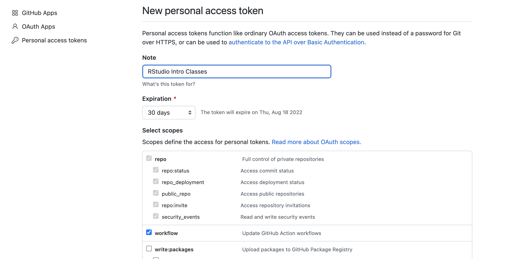

```{r setup, include=FALSE}
knitr::opts_chunk$set(echo = TRUE)
```

# Background Information

## R Project Management URLs

Introduction to Reproducible Publications with RStudio: <https://carpentries-incubator.github.io/Reproducible-Publications-with-RStudio/>

R for Reproducible Scientific Analysis: <https://swcarpentry.github.io/r-novice-gapminder/>

Reproducible Research Data and Project Management in R: <https://annakrystalli.me/rrresearchACCE20/>

Using Projects: <https://support.rstudio.com/hc/en-us/articles/200526207-Using-RStudio-Projects>

# Introduction

This one-hour class focuses on data and project management using R and RStudio. RStudio makes it possible to work on a complete research project in a more efficient, integrated, and organized manner. RStudio also connects with Git and Github and learners will have a chance to experiment with this integration and understand its advantages for collaboration and version control. This intermediate-level course is designed to be relevant to students from different disciplines. Some familiarity or experience in R and RStudio is recommended but not required. Students are encouraged to install [R](https://mirrors.nics.utk.edu/cran/) and [RStudio](https://www.rstudio.com/products/rstudio/download/#download) before the webinar so that they can follow along with the instructor. Attendees will need to download the class data before the webinar.

Upon completion of this class students should be able to:

-   Define scientific reproducibility
-   Discuss best practices for organizing data in an RStudio project
-   Discuss the importance of using a data dictionary and read me files
-   Ensure that their data is machine readable
-   Create a new R project using a GitHub repository
-   Distinguish between pulling and pushing data from a repository

# Scientific Reproducibility

According to the [U.S. National Science Foundation (NSF)](https://www.nsf.gov/sbe/AC_Materials/SBE_Robust_and_Reliable_Research_Report.pdf) subcommittee on replicability in science (2015):

Science should routinely evaluate the reproducibility of findings that enjoy a prominent role in the published literature. To make reproduction possible, efficient, and informative, researchers should sufficiently document the details of the procedures used to collect data, to convert observations into analyzable data, and to perform data analysis.

Reproducibility refers to the ability of a researcher to duplicate the results of a prior study using the same materials as were used by the original investigator. Reproducibility is a minimum necessary condition for a finding to be considered rigorous, believable and informative.

## Nature Survey on Reproducibility

A 2016 survey in Nature revealed that not being able to reproduce experiments is a problem across all domains of science [Figure 1]:

{width="6.5in"}

Figure 1: Reproducibility by discipline and problem identified [@RN1683].

{width="6.5in"}

Figure 2:Attempts to publish reproducible research [@RN1683].

## Five Compelling Reasons to Practice These Principles

If contributing to science and other researchers seems not to be compelling enough, here are 5 selfish reasons to follow reproducibility best practices [@RN1682].

### Helps to avoid data loss and disaster

{width="640"}

Two statisticians from MD Anderson found with research from Duke University.

The issues discovered by Baggerly and Coombes could have easily been spotted by any co-author before submitting the paper:

-   Data sets are not huge and can easily be spot-checked on a standard laptop

-   You do not have to be a statistics wizard to realize that patient numbers differ, labels got swapped or samples appear multiple times with conflicting annotations in the same data set.

Why did no one notice these issues before it was too late? Because the data and analysis were not transparent and required forensic bioinformatics to untangle.

### Makes it easier to write papers

Transparency in your analysis makes writing papers much easier. For example, in a dynamic document (R-markdown) so that the results automatically update when the data are changed.

### Helps reviewers see it your way

What do you think is a major complaint of authors when going through peer review and addressing comments? "Reviewers didn't even read the paper and had no idea what we were really doing. So, practice making the data and well-documented code easily accessible to the reviewers.

### Enables continuity of your work

Can you think of any examples where "not" employing this principle can lead to problems?

-   "I am so busy, I can't remember all the details of all my projects"
-   "I did this analysis 6 months ago. Of course I can't remember all the details after such a long time"
-   "My principle investigator (PI) said I should continue the project of a previous postdoc, but that postdoc is long gone and hasn't saved any scripts or data".

### Helps to build your reputation

For several papers, we have made our data, code and analyses available as an Experiment Package on Bioconductor. When I came up for tenure, I cited all of these packages as research output of my lab. Generally, making your analyses available in this way will help you to build a reputation for being an honest and careful researcher.

# RStudio

RStudio is an integrated development environment (IDE) for R and Python. It includes a console, syntax-highlighting editor that supports direct code execution, as well as tools for plotting, history, debugging, collaboration, and workspace management. It is a powerful tool which supports research by weaving the principles of reproducibility throughout the entire research lifecycle, from data gathering to the statistical analysis, presentation and publication of results.

## Advantages of Using RStudio

-   It is free and open-source
-   It is designed to make it easy to write and reuse code
-   Makes it convenient to view and interact with the objects stored in your environment
-   Makes it easy to set your working directory and access files on your computer
-   Integrates with Collaboration and Publishing Tools
-   Creates documents using R Markdown

## Setting up RStudio

There are a number of RStudio settings that are recommended. These settings will force RStudio to start "fresh" each time you open RStudio.

This means that RStudio will not remember the code that you ran in your previous session. This forces you to document your work in your code and not in the RStudio workspace [which is temporary].

Figure 3 list the preferred RStudio settings. To change these options go to **Tools\>Global Options\>General.**

{width="4.5in"}

Figure 3: Preferred RStudio options.

You might want to also choose UTF-8 as the default text encoding. This setting is available from **Tools\>Global Options\>Code\>Saving**.

## RStudio Projects

An [RStudio Project](https://support.rstudio.com/hc/en-us/articles/200526207-Using-Projects) provides a set of tools that allow you to organize your scripts, files, and output:

1.  Allows you to quickly navigate to your working directory

2.  Is a great way to keep all your data organized

3.  Can preserve custom settings and open files to make it easier to resume work after a break.

An RStudio project is different from an R session. Meaning that an R session is all the objects and work done in R. Sessions are usually kept in working memory, until you restart R.

There are three options for creating a project in RStudio:

1.  New Directory - start a brand new R project (with the option of version control).
2.  Existing Directory - add existing work to a R project (with the option of setting up version control).
3.  Version Control Continue an existing R project that already uses version control (i.e. download from GitHub).

We will be using option 3, creating a repository on GitHub, and then importing this into RStudio.

# Using Version Control

Using version control has the power to revolutionize how you work in R. Being able to have a record of all of the changes you've ever made to your code both locally and on a remote website is powerful. But getting everything set up can be a challenge. in this section I will walk through everything you need to do in order to use Git and GitHub alongside RStudio.

## Git Versus GitHub

1.  [Git is open source software for version control](https://en.wikipedia.org/wiki/Git "Opens in a new window"). Using Git, you can do things like see all previous versions of code you've ever created in a project.

2.  [GitHub](https://github.com/ "Opens in a new window") is the most popular service (others include [GitLab](https://gitlab.com/ "Opens in a new window") and [BitBucket](https://bitbucket.org/product "Opens in a new window")) for collaborating on code using Git.

It is possible to use Git without using GitHub, though most people combine the two.

## Why Should I Use Version Control for My Project?

There are many reasons you would want to adopt a Git/GitHub workflow:

1.  **Using Git and GitHub serves as a backup**. Because GitHub has a copy of all of the code you have locally, if anything were to happen to your computer, you'd still have access to your code.

2.  **Using Git and GitHub allows you to use version control.** Ever had documents called report-final.pdf, report-final-v2.pdf, and report-final-v3.pdf? Of course you have. Instead of making copies of files over fear of losing work, version control allows you to see what you did in the past, all while keeping single versions of documents.

3.  **Using Git and GitHub makes it possible to work on the same project at the same time as collaborators.** For many using Git/GitHub is better than collaborating using Dropbox, Google Drive, or OneDrive. Git and GitHub have built-in tools that enable simultaneous asynchronous work, a major benefit for those working in teams.

You might want to check out this 2016 [talk](https://youtu.be/eWxxfttcMts) by Alice Bartlett of the Financial Times, on Git and GitHub. Another great resources (one that I used for this section) can be found on [**Happy Git and GitHub for the useR**](https://happygitwithr.com/index.html)

## About Authentication to GitHub

When we interact with a remote Git server, such as GitHub, we have to include credentials in the request. This proves we are a specific GitHub user, who's allowed to do whatever we're asking to do.

You can access your resources in GitHub in a variety of ways: in the browser, via GitHub Desktop or another desktop application, with the API, or via the command line. Each way of accessing GitHub supports different modes of authentication.

-   Username and password with two-factor authentication

-   Personal access token

-   HTTPS

-   SSH key

### Authenticating in your browser

You will authenticate using your GitHub.com username and password. You may also use two-factor authentication and SAML single sign-on, which can be required by organization and enterprise owners. The help [documentation](https://docs.github.com/en/authentication/keeping-your-account-and-data-secure/about-authentication-to-github) for this topic on GitHub is an excellent resource.

### **Personal access token for HTTPS**

With HTTPS, we will use a **personal access token (PAT)**. Head over to chapter [10](https://happygitwithr.com/ssh-keys.html#ssh-keys) if you really want to set up SSH keys.

Let it be known that the password that you use to login to GitHub's website is NOT an acceptable credential when talking to GitHub as a Git server. This was possible in the past, but those days are over at GitHub. You can learn more in their blog post [Token authentication requirements for Git operations](https://github.blog/2020-12-15-token-authentication-requirements-for-git-operations/).

Here's the error you'll see if you try to do that now:

    remote: Support for password authentication was removed on August 13, 2021. Please use a personal access token instead.
    remote: Please see https://github.blog/2020-12-15-token-authentication-requirements-for-git-operations/ for more information.
    fatal: Authentication failed for 'https://github.com/OWNER/REPO.git/'

### Creating your PAT and Connecting it to Git

This is a very minimal account of getting and storing a PAT. This might be all you need when you're first getting yourself set up. You can always come back later and read other parts of this chapter.

1.  Go to <https://github.com/settings/tokens> and click "Generate token".

2.  Or you can do this from the R Terminal by using the [usethis](https://usethis.r-lib.org/) package. `usethis` is a workflow package: it automates repetitive tasks that arise during project setup and development, both for R packages and non-package projects.

```{r}
# install.packages("usethis")
library(usethis)
create_github_token()
```

3.  When you run this section of code your default browser will open and you will be prompted to log into GitHub. After you log in you will automatically go to the create repository page [Figure 4].

{width="640"}

Figure 4: Creating a new PAT on GitHub.

Look over the scopes; I highly recommend selecting "repo", "user", and "workflow". Recommended scopes will be pre-selected if you used `create_github_token()`.

4.  Click "Generate token".
5.  Copy the generated PAT to your clipboard. Or leave that browser window open and available for a little while, so you can come back to copy the PAT.
6.  Provide this PAT next time a Git operation asks for your password.
7.  You could even get out ahead of this and store the PAT explicitly right now. In R, call `gitcreds::gitcreds_set()` to get a prompt where you can paste your PAT. I am going to do this in Console to make it a bit easier.
8.  You should be able to work with GitHub now, i.e. push and pull.
9.  Remember, if you are already syncing on another computer, you will have to enter this new PAT before you push or pull.

Read on to learn more about:

-   [How to decide between the HTTPS and SSH protocols](https://happygitwithr.com/https-pat.html#https-vs-ssh)

-   [PAT scopes, names, and expiration](https://happygitwithr.com/https-pat.html#get-a-pat)

-   [PAT storage](https://happygitwithr.com/https-pat.html#store-pat)

-   [Troubleshooting](https://happygitwithr.com/https-pat.html#pat-troubleshooting)

## Choosing a URL for your remote repository

There are several ways to clone repositories available on GitHub.com.

When you view a repository while signed in to your account, the URLs you can use to clone the project onto your computer are available below the repository details.

For information on setting or changing your remote URL, see "[Managing remote repositories](https://docs.github.com/en/github/getting-started-with-github/managing-remote-repositories)."

## Creating a New Repository in GitHub

GitHub's collaborative approach to development depends on publishing commits from your local repository to GitHub for other people to view, fetch, and update.

[At this link](https://github.com/signup), you may sign into your GitHub account or create one if you have not already.

{width="6.5in"}

Figure 4: My repository homepage in GitHub

I have already created a [repository](https://github.com/doujouDC/nihl-intro-r-series.git) for this class. However Figure 5 is displaying the Create a New Repository screen. [Figure 5].

{width="6.5in"}

Figure 5: Creating a new repository on GitHub.

Once your repository is created, you will need to copy the repository URL before you create the project in RStudio [Figure 6]. Figure 6 shows the 3 different methods for creating a URL: (1) https, (2) SSH, or (3) GitHub CLI.

{width="6.5in"}

Figure 6: Creating a link to a GitHub repository.

The ability to create an SSH key is location under settings [Figure 7].

{width="6.5in"}

Figure 7: Creating SSH keys in GitHub.

## Before you "Sync" Your Repository

Depending on the authentic methods that you have in GitHub, you might also need to create a Personal Access Token that is used to connect RStudio to GitHub, the first time you sync [Figure 8].

{width="6.5in"}

Figure 8: Creating a Personal Access Code in GitHub.

Depending on the OS that you use, you might need to authenticate via the RStudio Shell. The RStudio Terminal is accessed from the Tools menu.

{width="6.5in"}

Figure 9: Connecting to the Shell via RStudio.

The first time to connect to your remote repository, you be prompted to enter your username and password via the Shell [Figure 10].

{width="6.5in"}

Figure 10: Accessing a project via the Shell.

As you can see I am in the project working directory: `ORS-02099312:nihl-intro-r-series joubertd$` If I type `ls`, I will see all of the files in my working directory [Figure 11]. There will be no folders when you first create a new project.

{width="6.5in"}

Figure 11: Files structure in my working directly.

If you need to check to see what your username and email are you can use:

`git config --global user.name` `git config --global user.email`

If you need a refresher, the Carpentries have a great [lesson](https://swcarpentry.github.io/git-novice/) on using GIT.

# Creating a New Project in RStudio

1.  Open RStudio
2.  Choose New Project from the Tools Menu.
3.  There are three options when creating a new project: (1) Creating a project in a new directory, (2) Creating a project in an existing directory, and (3) Creating a project using version control.

{width="4.5in"}

Figure 9: Creating a new project in RStudio.

4.  Choose the Version Control option
5.  Chose Git as the option, RStudio will automatically open the next screen

{width="4.5in"}

Figure 10: Choosing the version control option in RStudio.

6.  This screen is where you enter the repository URL that you copied from GitHub

{width="4.5in"}

Figure 11: Using a GitHub repository URL to create a new project

7.  Click **Create Project**. The screen will refresh as RStudio switches over to project view an downloads any data from GitHub

# Good Practices for Managing Projects in RStudio

## Sources

[**Good Practices for Managing Projects in RStudio**](Good%20Practices%20for%20Managing%20Projects%20in%20RStudio)

## Project Organization Issues

We often have stress points in our research that may become breaking points, especially when it comes to working with collaborators, returning to a project after a hiatus, or dealing with data and scripts. Let's discuss three of those common stress points:

### File/folder disorganization

-   You cannot find your files on your computer (or your cloud storage)
-   Multiple versions of files with names such as "finaldraft_4.txt"
-   Path issues when trying to run code
-   Reviewers or colleagues cannot re-run your code/analyses

### Storage and sharing issues

-   Files are only saved to your computer and are vulnerable (or have already succumbed to computer/hard drive failure
-   When working with collaborators, they (or you) don't share the files needed
-   Files are shared via email attachments
-   Difficult to know if you have the latest version of documents

### Losing track of project status

-   You cannot remember where you are in a project after being away for an extended period (or what you worked on the previous day...no judgement)
-   You aren't sure what you should be working on next
-   You have various to-do notes spread across your office or home (or never write them down in the first place)

## Discusion Points

To what extent do these stress points affect your research projects?

Are there additional issues that you've encountered that slow down or derail your work due to issues with project management?

## Project File/Folder Organization

Although there is no "best" way to lay out a project, there are some general principles to adhere to that will make project management easier.

## Practice good file-organization

[Good Enough Practices for Scientific Computing](http://swcarpentry.github.io/good-enough-practices-in-scientific-computing/) gives the following recommendations for project organization:

1.  Put each project in its own directory, which is named after the project.
2.  Put text documents associated with the project in the doc directory.
3.  Put raw data and metadata in the data directory, and files generated during cleanup and analysis in a results directory.
4.  Put source for the project's scripts and programs in the src directory, and programs brought in from elsewhere or compiled locally in the bin directory.
5.  Name all files to reflect their content or function.

Additionally, we'd recommend to include README, LICENSE, and CITATION files! Additional recommendations for projects and creating folders is covered in the Introduction to R and RStudio class. Class handouts are available upon request.

## Practices for Naming Files

### Machine-readable

No spaces, unsupported punctuation, accented characters, or case-sensitive file names

Deliberate use of delimiters (i.e. for splitting file names)

Consistently use the same delimiters: `data-analyses-fig1.R` as an example

### Human-readable

Name contains brief description of content: i.e. `data-analyses-fig1.R`

### Ordering Files

Use chronological or logical order. With chronological, file name starts with date.

-   i.e. `2022-01-01_data_analyses.R`

-   Use [ISO 8601 date standard](https://en.wikipedia.org/wiki/ISO_8601)

-   **logical**: filename starts with a number or keyword/number combo.

    -   i.e. `01_data_preprocessing.R` *see code directory*

    -   i.e. `CC-101_1_data.csv` *see data directory*

Adapted from <https://datacarpentry.org/rr-organization1/01-file-naming/index.html>. For more tips on file naming, check: [The Dos and Don'ts of File Naming](https://www.library.ucsb.edu/sites/default/files/dls-n01-2021-filenaming.pdf).

# Pushing and Pulling from GitHub

Start on Tuesday

# Licenses

Licensed under [CC-BY 4.0](https://creativecommons.org/licenses/by/4.0/) 2022 by [the authors](https://carpentries-incubator.github.io/Reproducible-Publications-with-RStudio/CITATION).

# References
