```{r setup, include=FALSE}
knitr::opts_chunk$set(echo = TRUE)
```

# Background Information

## R Project Management URLs

Introduction to Reproducible Publications with RStudio: <https://carpentries-incubator.github.io/Reproducible-Publications-with-RStudio/>

R for Reproducible Scientific Analysis: <https://swcarpentry.github.io/r-novice-gapminder/>

Reproducible Research Data and Project Management in R: <https://annakrystalli.me/rrresearchACCE20/>

Using Projects: <https://support.rstudio.com/hc/en-us/articles/200526207-Using-RStudio-Projects>

# Introduction

This one-hour class focuses on data and project management using R and RStudio. RStudio makes it possible to work on a complete research project in a more efficient, integrated, and organized manner. RStudio also connects with Git and Github and learners will have a chance to experiment with this integration and understand its advantages for collaboration and version control. Participants will learn how to create reproducible documents that combine code, analysis, and narrative. This intermediate-level course is designed to be relevant to students from different disciplines. Some familiarity or experience in R and RStudio is recommended but not required. Students are encouraged to install [R](https://mirrors.nics.utk.edu/cran/) and [RStudio](https://www.rstudio.com/products/rstudio/download/#download) before the webinar so that they can follow along with the instructor. Attendees will need to download the class data before the webinar.

Upon completion of this class students should be able to:

-   Discuss best practices for organizing data in an RStudio project
-   Define the term tidy data and its role in reproducibility
-   List the recommendations for tidy data
-   Discuss the importance of using a data dictionary and read me files
-   Ensure that their data is machine readable
-   Create a new R project using a GitHub repository
-   Distinguish between pulling and pushing data from a repository
-   Create an R-markdown document
-   Create a bibliography and link it to a R-markdown document

# Scientific Reproducibility

According to the [U.S. National Science Foundation (NSF)](https://www.nsf.gov/sbe/AC_Materials/SBE_Robust_and_Reliable_Research_Report.pdf) subcommittee on replicability in science (2015):

Science should routinely evaluate the reproducibility of findings that enjoy a prominent role in the published literature. To make reproduction possible, efficient, and informative, researchers should sufficiently document the details of the procedures used to collect data, to convert observations into analyzable data, and to perform data analysis.

Reproducibility refers to the ability of a researcher to duplicate the results of a prior study using the same materials as were used by the original investigator. Reproducibility is a minimum necessary condition for a finding to be considered rigorous, believable and informative.

A 2016 survey in Nature revealed that not being able to reproduce experiments is a problem across all domains of science [Figure 1]:

{width="6.5in"}

Figure 1: Reproducibility by discipline and problem identified [@RN1683].

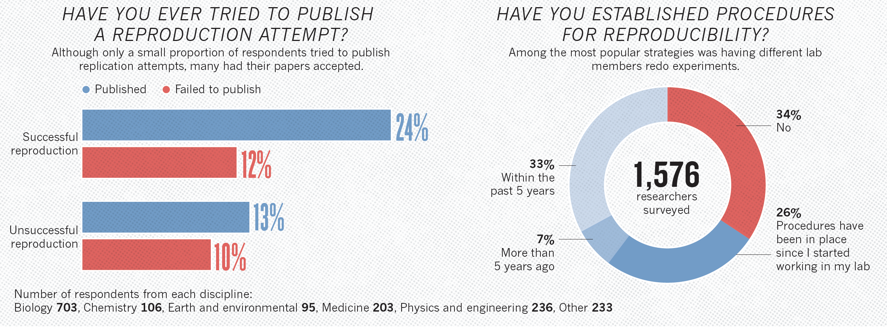{width="6.5in"}

Figure 2:Attempts to publish reproducible research [@RN1683].

If contributing to science and other researchers seems not to be compelling enough, here are 5 selfish reasons to work reproducibly according to Markowetz (2015):

-   Helps to avoid data loss and disaster

-   Makes it easier to write papers

-   Helps reviewers see it your way

-   Enables continuity of your work

-   Helps to build your reputation

# Using RStudio for your project

RStudio is an integrated development environment (IDE) for R and Python. It includes a console, syntax-highlighting editor that supports direct code execution, as well as tools for plotting, history, debugging, collaboration, and workspace management. It is a powerful tool which supports research by weaving the principles of reproducibility throughout the entire research lifecycle, from data gathering to the statistical analysis, presentation and publication of results.

## Advantages of Using RStudio

-   It is free and open-source
-   It is designed to make it easy to write and reuse code
-   Makes it convenient to view and interact with the objects stored in your environment
-   Makes it easy to set your working directory and access files on your computer
-   Integrates with Collaboration and Publishing Tools
-   Creates documents using R Markdown

## Setting up R for Projects

There are a number of RStudio settings that are recommended. These settings will force RStudio to start "fresh" each time you open RStudio.

This means that RStudio will not remember the code that you ran in your previous session. This forces you to document your work in your code and not in the RStudio workspace [which is temporary].

Figure 3 list the preferred RStudio settings. To change these options go to **Tools\>Global Options\>General.**

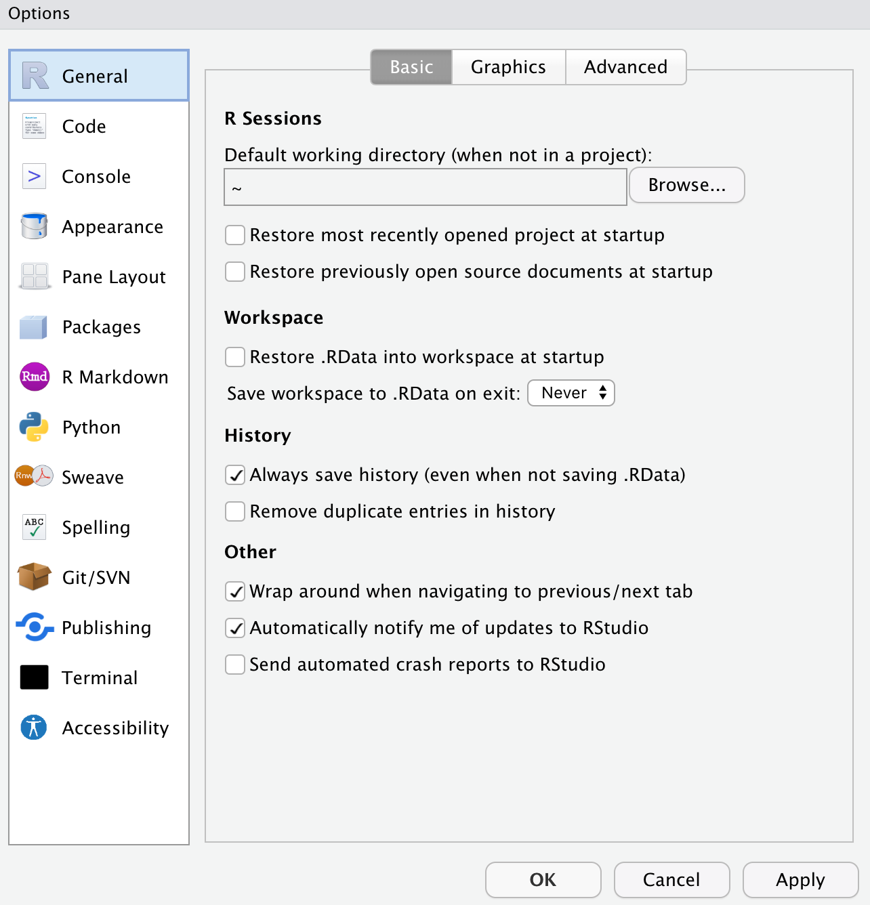{width="4.5in"}

Figure 3: Preferred RStudio options.

You might want to also choose UTF-8 as the default text encoding. This setting is available from **Tools\>Global Options\>Code\>Saving**.

## RStudio Projects

An [RStudio Project](https://support.rstudio.com/hc/en-us/articles/200526207-Using-Projects) provides a set of tools that allow you to organize your scripts, files, and output: \* Allows you to navigate quickly to your working directory, and it is a great way to keep all your data organized. \* Can preserve custom settings and open files to make it easier to resume work after a break. \* An RStudio project is different from an R session. Meaning that an R session is all the objects and work done in R. Sessions are usually kept in working memory, until you restart R.

## 

# Creating a Project Using Version Control in RStudio

Using version control is a powerful feature to make your research more reproducible and better organized. In order to use versioning while working in RStudio the first step is to make sure your work is set up as an R Project, because you may not use the versioning features in RStudio without one. There are three options for doing this depending on your given scenario:

1.  New Directory - start a brand new R project (with the option of version control).
2.  Existing Directory - add existing work to a R project (with the option of setting up version control).
3.  Version Control Continue an existing R project that already uses version control (i.e. download from GitHub).

We will be using option 3, setting an R project on GitHub and then importing this into RStudio.

##About Authentication to GitHub

You can securely access your account's resources by authenticating to GitHub, using different credentials depending on where you authenticate.

To keep your account secure, you must authenticate before you can access certain resources on GitHub. When you authenticate to GitHub, you supply or confirm credentials that are unique to you to prove that you are exactly who you declare to be.

You can access your resources in GitHub in a variety of ways: in the browser, via GitHub Desktop or another desktop application, with the API, or via the command line. Each way of accessing GitHub supports different modes of authentication.

-   Username and password with two-factor authentication

-   Personal access token

-   SSH key

##Authenticating in your browser\*\*

You will authenticate using your GitHub.com username and password. You may also use two-factor authentication and SAML single sign-on, which can be required by organization and enterprise owners. The help [documentation](https://docs.github.com/en/authentication/keeping-your-account-and-data-secure/about-authentication-to-github) for this topic on GitHub is an excellent resource. I will talk about sync issues in a separate section.

##Choosing a URL for your remote repository\*\*

There are several ways to clone repositories available on GitHub.com.

When you view a repository while signed in to your account, the URLs you can use to clone the project onto your computer are available below the repository details.

For information on setting or changing your remote URL, see "[Managing remote repositories](https://docs.github.com/en/github/getting-started-with-github/managing-remote-repositories)."

## Creating a New Repository in GitHub

GitHub's collaborative approach to development depends on publishing commits from your local repository to GitHub for other people to view, fetch, and update.

[At this link](https://github.com/signup), you may sign into your GitHub account or create one if you have not already.

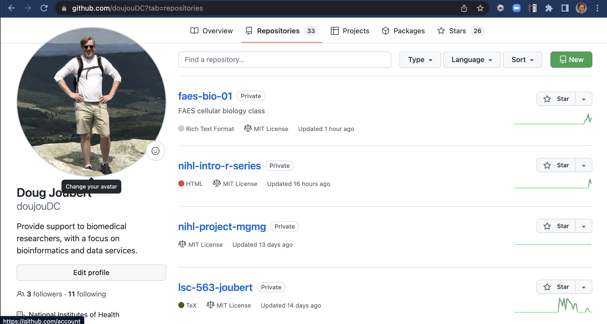{width="6.5in"}

Figure 4: My repository homepage in GitHub

I have already created a [repository](https://github.com/doujouDC/nihl-intro-r-series.git) for this class. However Figure 5 is displaying the Create a New Repository screen. [Figure 5].

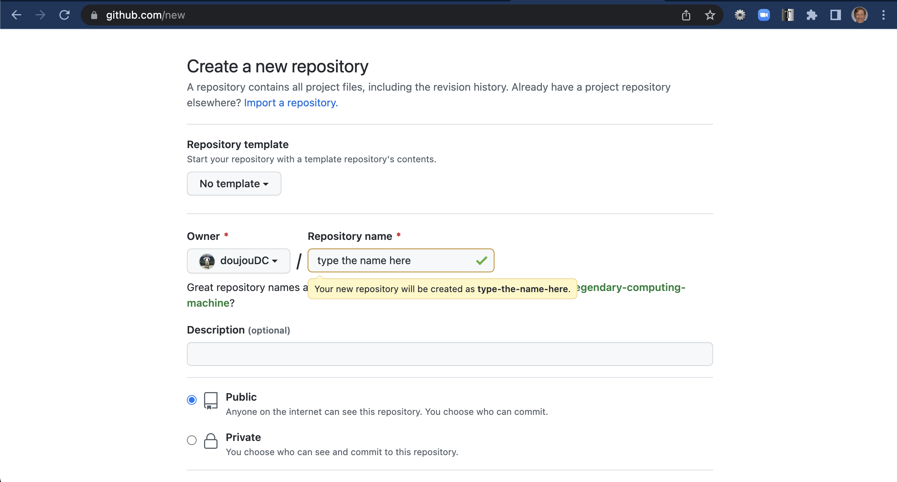{width="6.5in"}

Figure 5: Creating a new repository on GitHub.

Once your repository is created, you will need to copy the repository URL before you create the project in RStudio [Figure 6]. Figure 6 shows the 3 different methods for creating a URL: (1) https, (2) SSH, or (3) GitHub CLI.

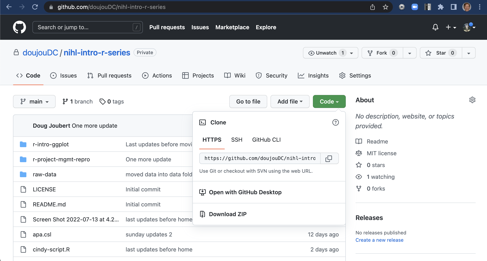{width="6.5in"}

Figure 6: Creating a link to a GitHub repository.

The ability to create an SSH key is location under settings [Figure 7].

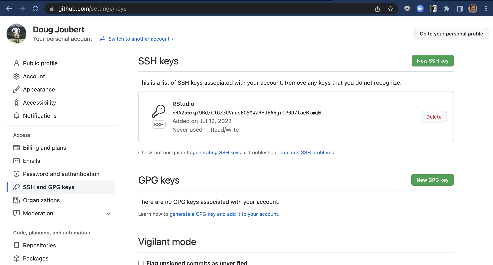{width="6.5in"}

Figure 7: Creating SSH keys in GitHub.

## Before you "Sync" Your Repository

Depending on the authentic methods that you have in GitHub, you might also need to create a Personal Access Token that is used to connect RStudio to GitHub, the first time you sync [Figure 8].

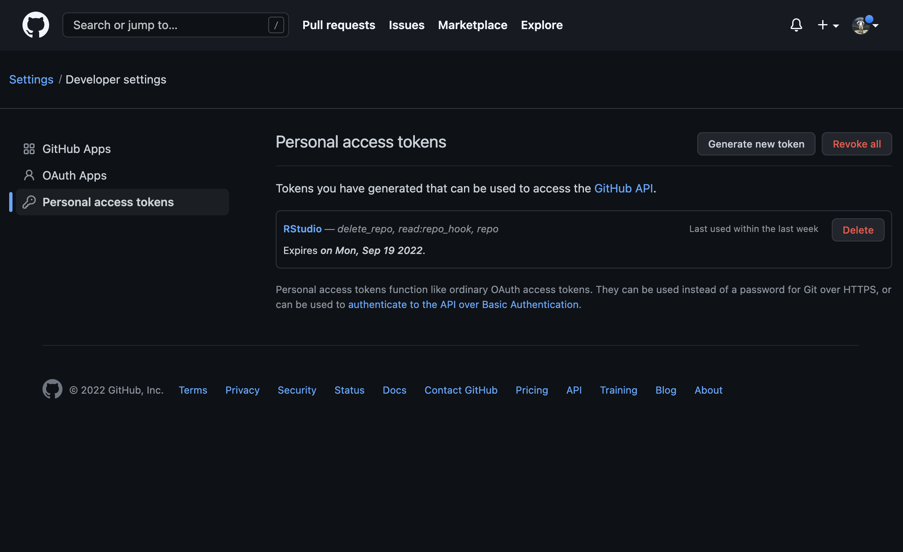{width="6.5in"}

Figure 8: Creating a Personal Access Code in GitHub.

Depending on the OS that you use, you might need to authenticate via the RStudio Shell. The RStudio Terminal is accessed from the Tools menu.

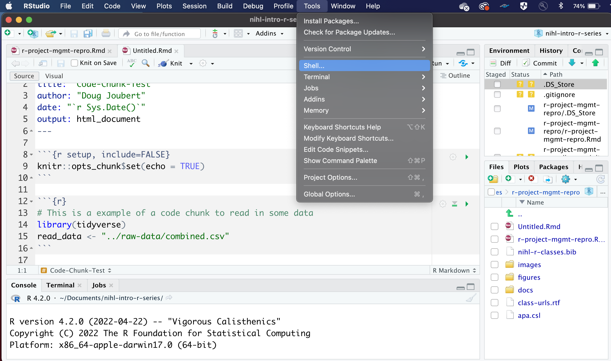{width="6.5in"}

Figure 9: Connecting to the Shell via RStudio.

The first time to connect to your remote repository, you be prompted to enter your username and password via the Shell [Figure 10].

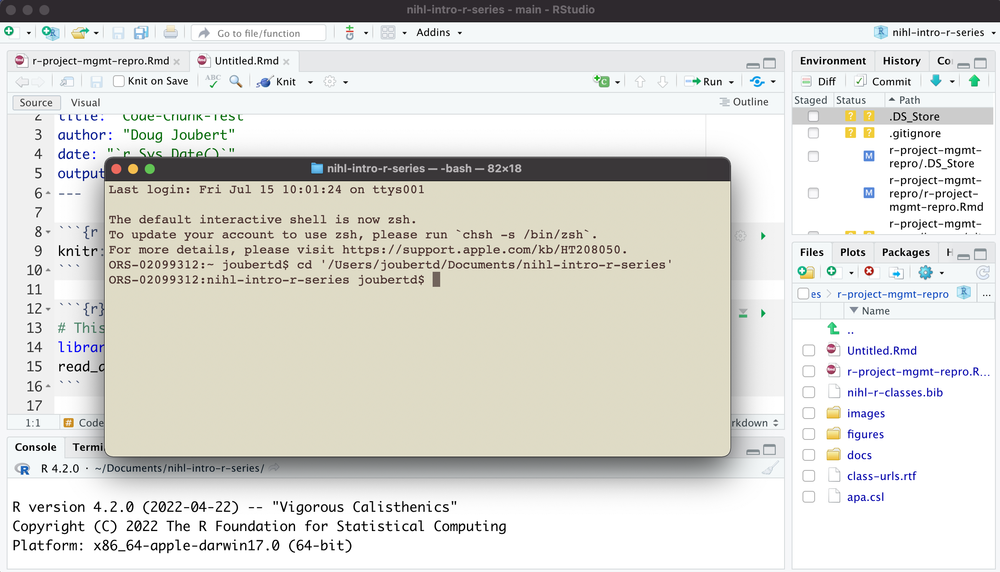{width="6.5in"}

Figure 10: Accessing a project via the Shell.

As you can see I am in the project working directory: `ORS-02099312:nihl-intro-r-series joubertd$` If I type `ls`, I will see all of the files in my working directory [Figure 11]. There will be no folders when you first create a new project.

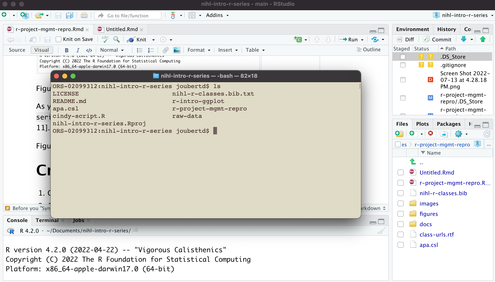{width="6.5in"}

Figure 11: Files structure in my working directly.

If you need a refresher, the Carpentries have a great [lesson](https://swcarpentry.github.io/git-novice/) on using GIT.

# Creating a New Project in RStudio

1.  Open RStudio
2.  Choose New Project from the Tools Menu.
3.  There are three options when creating a new project: (1) Creating a project in a new directory, (2) Creating a project in an existing directory, and (3) Creating a project using version control.

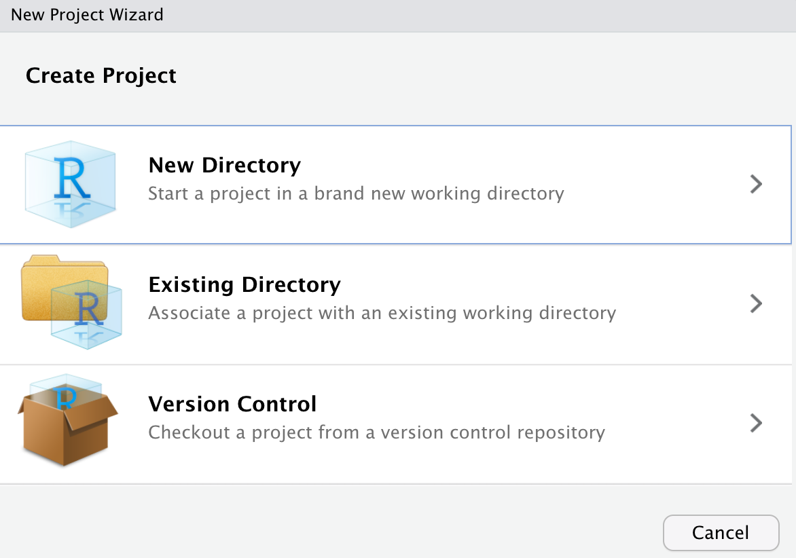{width="4.5in"}

Figure 9: Creating a new project in RStudio.

4.  Choose the Version Control option
5.  Chose Git as the option, RStudio will automatically open the next screen

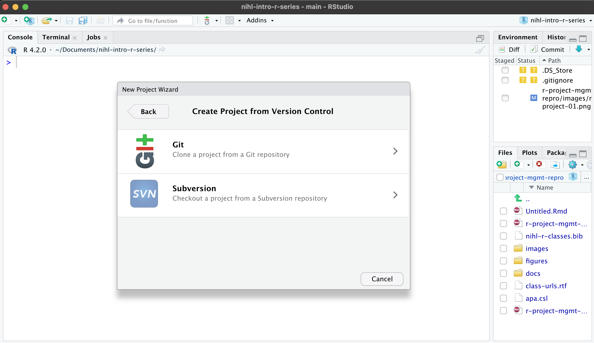{width="4.5in"}

Figure 10: Choosing the version control option in RStudio.

6.  This screen is where you enter the repository URL that you copied from GitHub

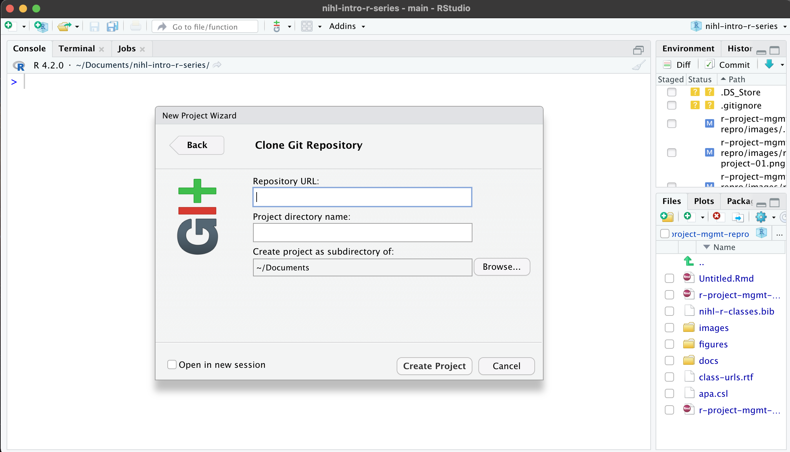{width="4.5in"}

Figure 11: Using a GitHub repository URL to create a new project

7.  Click **Create Project**. The screen will refresh as RStudio switches over to project view an downloads any data from GitHub

# Good Practices for Managing Projects in RStudio

## Sources

[**Good Practices for Managing Projects in RStudio**](Good%20Practices%20for%20Managing%20Projects%20in%20RStudio)

## Project Organization Issues

We often have stress points in our research that may become breaking points, especially when it comes to working with collaborators, returning to a project after a hiatus, or dealing with data and scripts. Let's discuss three of those common stress points:

### File/folder disorganization

-   You cannot find your files on your computer (or your cloud storage)
-   Multiple versions of files with names such as "finaldraft_4.txt"
-   Path issues when trying to run code
-   Reviewers or colleagues cannot re-run your code/analyses

### Storage and sharing issues

-   Files are only saved to your computer and are vulnerable (or have already succumbed to computer/hard drive failure
-   When working with collaborators, they (or you) don't share the files needed
-   Files are shared via email attachments
-   Difficult to know if you have the latest version of documents

### Losing track of project status

-   You cannot remember where you are in a project after being away for an extended period (or what you worked on the previous day...no judgement)
-   You aren't sure what you should be working on next
-   You have various to-do notes spread across your office or home (or never write them down in the first place)

## Discusion Points

To what extent do these stress points affect your research projects? Are there additional issues that you've encountered that slow down or derail your work due to issues with project management?

## Project File/Folder Organization

Although there is no "best" way to lay out a project, there are some general principles to adhere to that will make project management easier.

## Practice good file-organization

[Good Enough Practices for Scientific Computing](http://swcarpentry.github.io/good-enough-practices-in-scientific-computing/) gives the following recommendations for project organization:

1.  Put each project in its own directory, which is named after the project.
2.  Put text documents associated with the project in the doc directory.
3.  Put raw data and metadata in the data directory, and files generated during cleanup and analysis in a results directory.
4.  Put source for the project's scripts and programs in the src directory, and programs brought in from elsewhere or compiled locally in the bin directory.
5.  Name all files to reflect their content or function.

Additionally, we'd recommend to include README, LICENSE, and CITATION files! Additionaly recommendations for projects and creating folders is covered in the Introduction to R and Rstudio class. Class handouts are available upon request.

## Practices for Naming Files

### Machine-readable

No spaces, unsupported punctuation, accented characters, or case-sensitive file names

Deliberate use of delimiters (i.e. for splitting file names)

Consistently use the same delimiters: `data-analyses-fig1.R` as an example

### Human-readable

Name contains brief description of content: i.e. `data-analyses-fig1.R`

### Ordering Files

Use chronological or logical order. With chronological, file name starts with date.

-   i.e. `2022-01-01_data_analyses.R`

-   Use [ISO 8601 date standard](https://en.wikipedia.org/wiki/ISO_8601)

-   **logical**: filename starts with a number or keyword/number combo.

    -   i.e. `01_data_preprocessing.R` *see code directory*

    -   i.e. `CC-101_1_data.csv` *see data directory*

Adapted from <https://datacarpentry.org/rr-organization1/01-file-naming/index.html>. For more tips on file naming, check: [The Dos and Don'ts of File Naming](https://www.library.ucsb.edu/sites/default/files/dls-n01-2021-filenaming.pdf).

# Working with R Markdown Files

R Markdown provides an authoring framework for data science. You can use a single R Markdown file to both

-   save and execute code

-   generate high quality reports that can be shared with an audience

R Markdown documents are fully reproducible and support dozens of static and dynamic output formats.

## Installation

Like the rest of R, R Markdown is free and open source. You can install the R Markdown package from CRAN with:

    install.packages("rmarkdown")

You will also need to install the [knitr](http://yihui.name/knitr/) package. Knitr is a general-purpose tool for dynamic report generation in R using Literate Programming techniques.

    install.packages("knitr")

There are a number of packages that are required for `rmarkdown` and `knitr`, these should install automatically.

### Getting Started

This [page](https://rmarkdown.rstudio.com/lesson-1.html) provides a nice overview of R markdown the top provide examples of R Markdown documents, as well as an in depth discussion of various R Markdown topics.

You may also find the following resources helpful:

-   [The R Markdown Cheatsheet](https://github.com/rstudio/cheatsheets/raw/main/rmarkdown-2.0.pdf)

-   [The R Markdown Reference Guide](https://www.rstudio.com/wp-content/uploads/2015/03/rmarkdown-reference.pdf)

-   [R Markdown Cookbook](https://bookdown.org/yihui/rmarkdown-cookbook/)

## Writing and Styling Rmd Documents

Let us create a new document by navigating to `File > New File > R Markdown`.

-   Add the title `Code-Chunk-Test`.

-   Add your name as author

-   Select "Use current date when rendering documents"

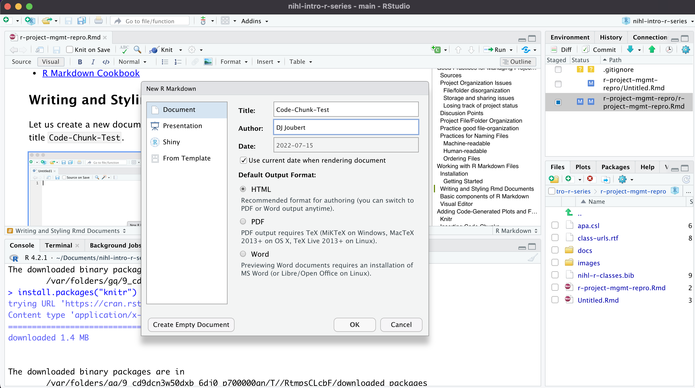{width="6.5in"}

Figure 8: Creating a new markdown document

If you scroll down the doc that you just created you can see that the RMD file is already populated with text and code.

Let's first delete the generic text because we don't need it at this point (all except the first code chunk that is - we'll get back to that in a second).

## Basic components of R Markdown

The initial chunk of text (header) contains instructions for R to specify what kind of document will be created, and the options chosen. You can use the header to give your document a title, author, date, and tell it what type of output you want to produce.

    ---
    title: "Introduction to R Markdown"
    author: "Doug Joubert"
    date: "`r Sys.Date()`"
    output: html_document
    ---

You can delete any of those fields if you don't want them included. The double-quotes aren't strictly *necessary* in this case. They're mostly needed if you want to include a colon in the title.

Note that you have the option to select *Use the current date when rendering the document*. If you choose so, this will generate the date dynamically each time you knit your document and replace the rmd creation date with the inline R expression:

`r Sys.Date()`

You may also consider exploring changing date formats [following these tips](https://bookdown.org/yihui/rmarkdown-cookbook/update-date.html).

## Source Editor

The image below displays the default R Markdown template in the "source editor" mode. Notice the symbols scattered throughout the text (#, \*, \<\>). Those are examples of R Markdown syntax, which is a flavor of Markdown syntax, an easy and quick, human-readable markup language for document styling.

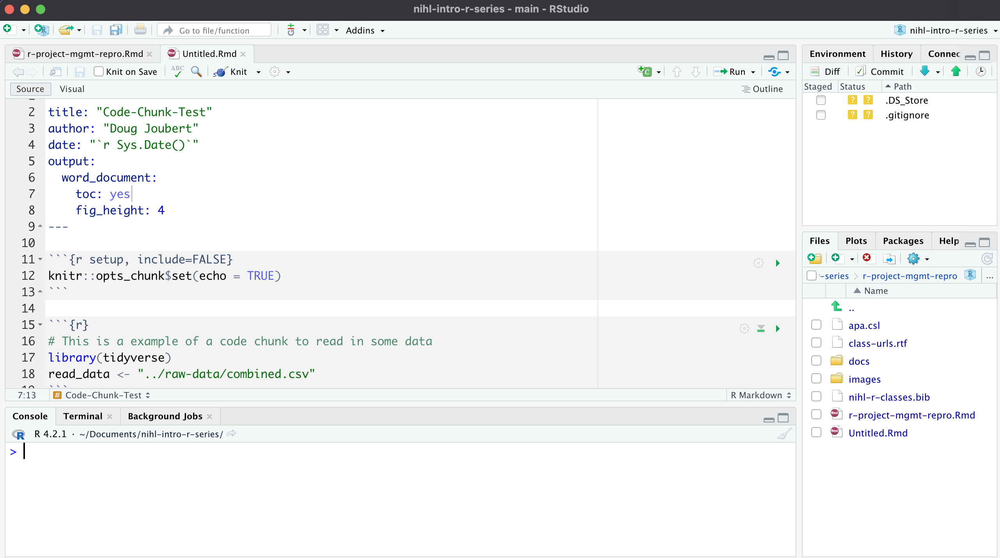{width="6.5in"}

Figure 9: Creating an RMD file in RStudio.

## Visual Editor

RStudio released a new major update to their IDE in January 2020, which includes a new "visual editor" for R Markdown to supplement their original editor (which we will call the source editor) for authoring with R Markdown syntax.

The new visual editor is friendlier with a graphical user interface similar to Word or Google docs that lets you choose styling options from the menu (before you had to either have the R Markdown code memorized or look it up for each of your styling choices). Another major benefit is that the new editor renders the R Markdown styling in real time so you can preview your paper before rendering to your output format. The image below is displaying the same document using the visual editor.

{width="6.5in"}

Figure 10: Source/Visual options for markdown

On a PC the visual editor is accessible through a small button on the far right side of the script/document pane in RStudio. The icon is a protractor, but from further away it just looks like a squiggly "A".

On a Mac there are Source/Visual tabs on the Menu panel

# Adding Code-Generated Plots and Figures

There are two main ways to process code with Knitr in R Markdown documents:

1.  Code Chunks

2.  Inline Code

## Inserting Code Chunks

Code chunks are better when you need to do something more sophisticated with your code, such as building plots or tables. They also incorporate syntax which allows modifications to how that code is rendered and styled in your final output. We'll learn more about that as we walk through the "anatomy" of a code chunk.

## Basic Anatomy of the Code Chunk

You can quickly insert chunks like these into your file with:

-   the keyboard shortcut Ctrl + Alt + I (OS X: Cmd + Option + I)

-   the Add Chunk command in the editor toolbar

-   or by typing the chunk delimiters {r} and \`\`\`.

The most basic (and empty) code chunk looks like this:

{width="6.5in"}

Although I am demostrating using R in this workshop, it's possible to use other programming or markup languages. For example, we have seen that we can use LaTeX code for equations. You can also use python and a handful of other languages.

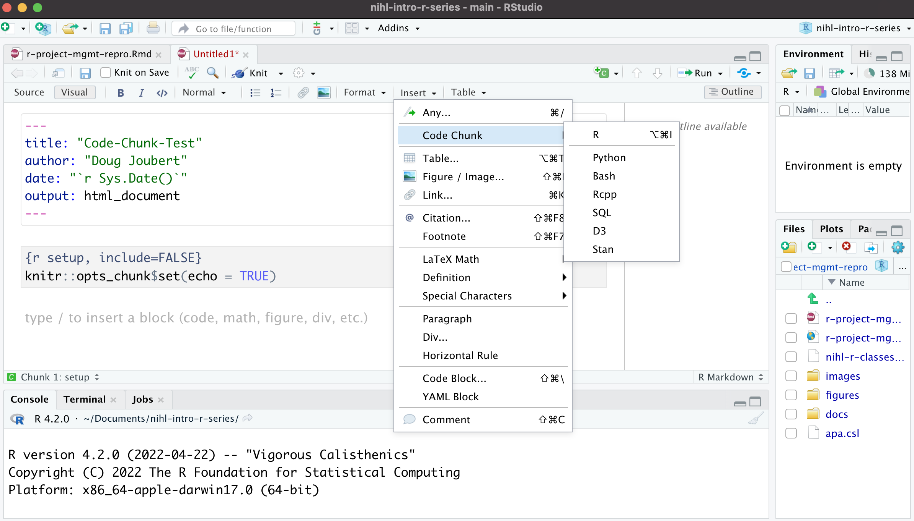{width="6.5in"}

Figure 11: Code options available in R-markdown.

There's a button you can use in the RStudio menu to generate the code chunks automatically. Automatic code chunk generation is available for several other languages as well. Also, you can use the keyboard shortcut `ctrl`+`alt`+`i` for Windows and `command`+`option`+`i` for Mac. As you can see in Figure 12, the console is blank because we have not executed/run the code chunk. Let us enter the following read statement into our first code chunk:

`# This is a example of a code chunk to read in some data`

`library(tidyverse)`

`read_data <- "../raw-data/combined.csv"`

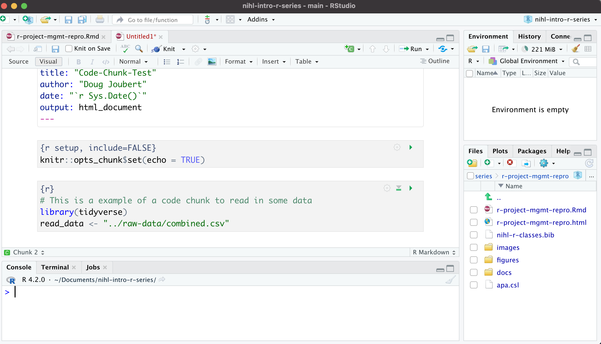{width="6.5in"}

Figure 12: Code chunk in R-markdown.

## Run the code in a code chunk

There are 3 main options for running and debugging code that don't require us to wait for the file to render.

1)  Run from code chunk (green play button on the right top corner). This allows us to run one specific code chunk [Figure13].

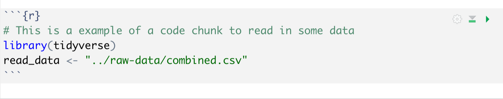{width="6.5in"}

Figure 13: Running a code chunk from the code-box.

2.  Run menu, which gives more options for running code chunks including the current one, the next one, all chunks, etc [Figure 14].

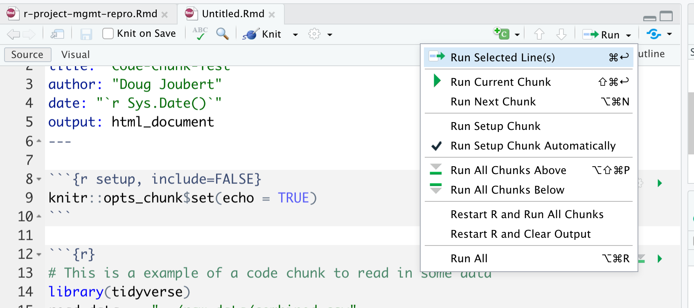{width="6.5in"}

Figure 14: Running a code chunk from the Code-Chunk menu.

3.  Using keyboard shortcuts

| **Task**                   | **Windows & Linux** | **macOS**           |
|:---------------------------|:--------------------|:--------------------|
| Create a code chunk        | Ctrl + Alt + I      | Cmd + Option + I    |
| Run all chunks above       | Ctrl+Alt+P          | Command+Option+P    |
| Run current chunk          | Ctrl+Alt+C          | Command+Option+C    |
| Run current chunk          | Ctrl+Shift+Enter    | Command+Shift+Enter |
| Run next chunk             | Ctrl+Alt+N          | Command+Option+N    |
| Run all chunks             | Ctrl+Alt+R          | Command+Option+R    |
| Go to next chunk/title     | Ctrl+PgDown         | Command+PgDown      |
| Go to previous chunk/title | Ctrl+PgUp           | Command+PgUp        |

## **Labeling Code Chunk**

While not necessary for running your code, it is good practice is to give a name to each code chunk because it gives the chunk a unique identifier which allows for more advanced options (such as cross-referencing) to work with your rmd files later on:

`{r chunk-name}`

Some things to keep in mind

-   The chunk name is the only value other than r in the code chunk options that doesn't require a tag (i.e. `echo =` )

-   The chunk label has to be unique (i.e.you can't use the the same name for multiple chunks)

We'll see in a bit where this code chunk label comes in handy. But, for now let's go back and give our first code chunk a name:

1.  `{r Importing our Data}`

2.  Then, run the code-chunk

Figure 15 is displaying the output of the code-chunk. Can you explain what is happening in the console?

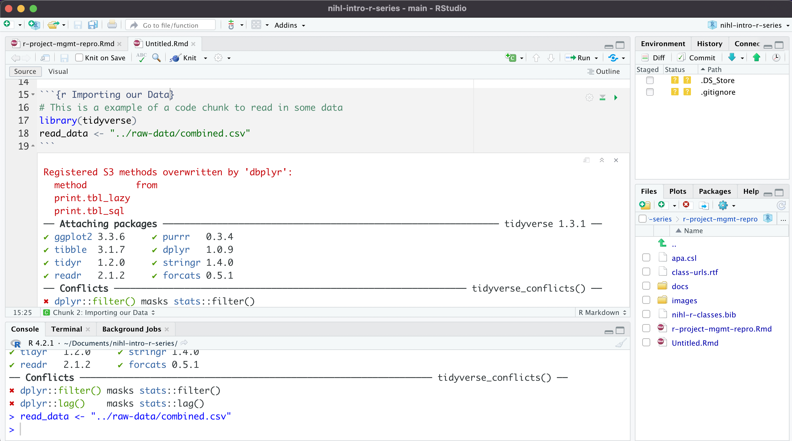{width="6.5in"}

Figure 15: Output from our first code chunk.

## Code Chunk Options

There are over 50 different code chunk options. Wow, that is a lot. Obviously we will not go over all of them, but they fall into several larger categories including: code evaluation, text output, code style, cache options, plot output and animation.

You can find a complete list of code chunk options on Knitr developer, Yihui Xie's, [online guide to knitr](https://yihui.org/knitr/options/). Or, you can find a brief list of all options on the R Markdown Reference guide on page 3 accesible through the RStudio Interface by navigating to the main menu bar `Help > Cheat Sheets > R Markdown Reference Guide`.

The chunk name is the only value other than `r` in the code chunk options that doesn't require a tag (i.e. the "= VALUE" part of `option = VALUE`). So chunk options will always require a tag, and the syntax will be in the form:

`{r chunk-label, option = VALUE}`

The option always follows the code chunk label (don't forget to add a `,` after the label either).

## Code Evaluation Option

-   **include** = (logical) whether to include the chunk output in the output document (defaults to TRUE).

## **Text Output Options**

-   **eval** = (logical or numeric) TRUE/FALSE to evaluate (or not) or a numeric value like c(1,3) (only evaluate expressions 1 and 3)

-   **echo** = (logical or numeric - following the same rules as above) whether to display source code or not.

-   **results** = (logical or character) text output of the code can be hidden (hide or FALSE), or delineated in a certain way (default 'markup').

-   **warning** = (logical) whether to display the warnings in the output (default TRUE). FALSE will output warnings to the console only.

-   **message** = (logical) whether or not to display messages that appear when running the code (default TRUE).

## Producing Your Document

## Knitr

[Knitr](https://yihui.org/knitr/) is the engine in RStudio which creates the "dynamic" part of R Markdown reports. It's specifically a package that allows the integration of R code into the html, word, pdf, or LaTex document you have specified as your output for R Markdown.

We just saw how to run our code in our code chunks to see a preview of the code output. However, if we want to produce a final report with code, we need to use the Knit button. Using the knit button with code chunks is a two step process:

1.  The code is run (all code chunks will run automatically).
2.  Second, (if there are no code errors) the document of choice will render for our whole R Markdown document.
3.  Figure 15 is showing the Knitr options available

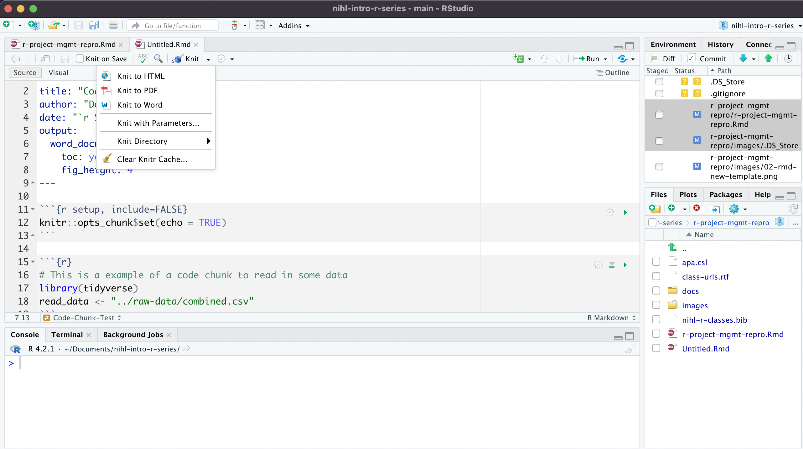{width="6.5in"}

Figure 15: Knitr options in R-markdown.

# **Global Code Chunk Options**

Let's direct our attention back to the first code chunk in this document that I asked you not to delete.

The code looks like:

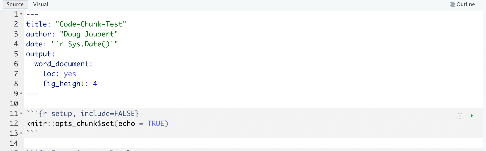{width="624"}

Figure 16: Example of a global code chunk.

This is an option to globally set options for the entire R Markdown document. Can you imagine how much work it would be to add the chunk options each time? Also, what if we need different options for different figures. We can automate setting options by adding this special code chunk at the beginning of the document. Then, each code chunk we add will refer to those "global" options when it runs.

# Reproducible & Efficient Methods of Using Code Chunks

I think this should be an advanced class. I will need to identify "breakpoints" after I do the dry run and teach the class for the first time.

# Bibliography, Citations & Cross-Referencing

Older versions of RStudio require [Pandoc's](https://pandoc.org/MANUAL.html#citation-syntax) citation syntax to render bibliographies correctly. We won't be covering this approach extensively in this workshop, since the new visual editor has made this process much more simple. You can refer to our [previous workshop on R Markdown](https://ucsbcarpentry.github.io/R-markdown/06-citations-bib/index.html) pre-visual editor for more information.

The new visual editor in RStudio 1.4 has made citations and cross-referencing much easier, by offering different options for referencing various types of sources. Before getting into these different features, let's first learn how you can call the citation window dialog on Rstudio and how to navigate these different options.

## Creating Your Reference List

You need to have a list of references saved to a bib file before you can insert citations into your R-markdown document. A file with the BIB file extension is a BibTeX Bibliographical Database file. It's a specially formatted text file that lists references pertaining to a particular source of information. Each item can be edited, in case there is any metadata incorrect or missing.

There are a number of ways to create your bib file.

1.  Manually
2.  Use a citation tool like Endnote or Zotero
3.  Use the lookup feature to search for publications by DOI (Digital Object Identifier), Crossref, DataCite, or PubMed ID

Most citation and reference management tools such as Refworks, Endnote, Mendeley and Zotero, as well as some most scientific databases allow you to export citations as .bib [BibteX](https://en.wikipedia.org/wiki/BibTeX) files.. I am going to show you how to export references from Endnote to your bib file. Figure 17 is displaying all of the references in my Endnote Library. I have highlighted the Bioinformatics folder since I only want to explore these records.

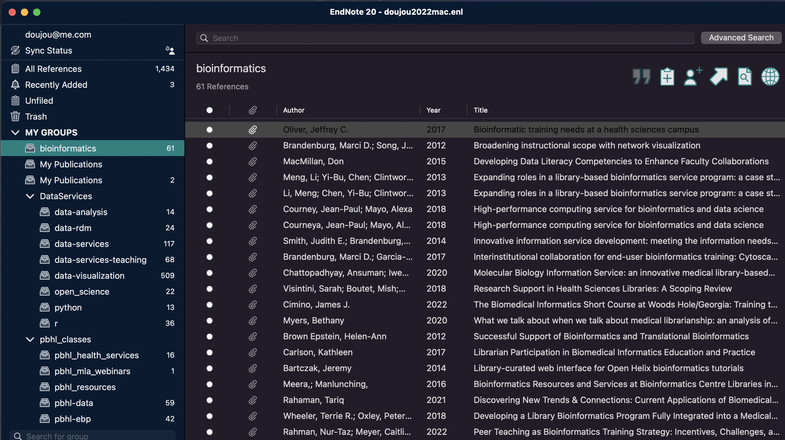{width="640"}

Figure 17: Example of an Endnote Library.

The first thing I need to do is to get the records in the correct format (bibtex). The Output Style Manager is locating under the Tools Menu (I am on Mac OS) [Figure 18].

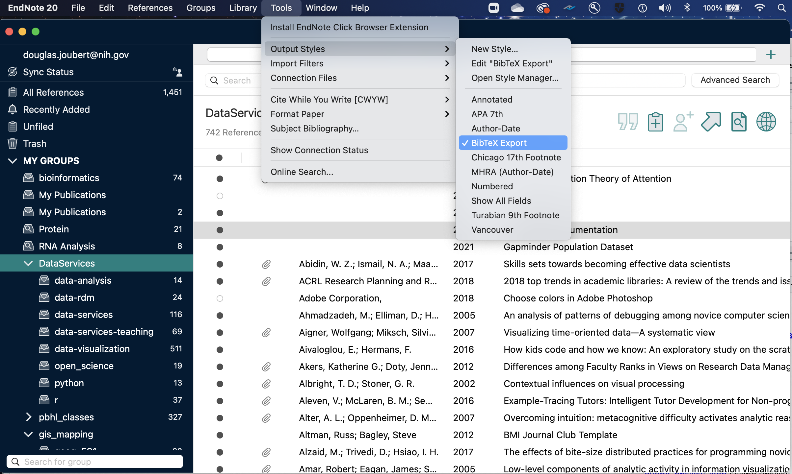{width="624"}

Figure 18: Selecting the bibtext output format in Endnote.

If *bibtext* format is not in the list of styles, you can use **Open Style Manager** to search for the *bibtex* format.

The next step is to select all of the references that you want in your bib file and choose the **Copy Formatted Reference** option [Figure 19]. Please note that using **Copy** will not work.

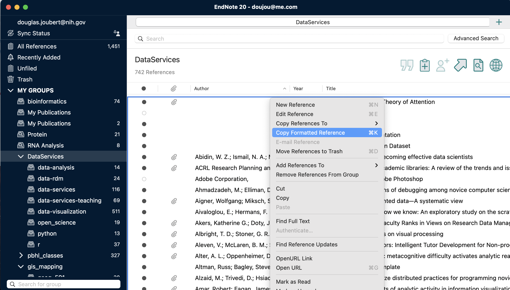{width="642"}

Figure 19: Copying references from an Endnote Library in *bibtext* format.

Figure 20 i showing single reference that I pasted into a text editor. As you can see in Figure 20, the *bibtext* format is a tagged format that starts with an *article tag*.

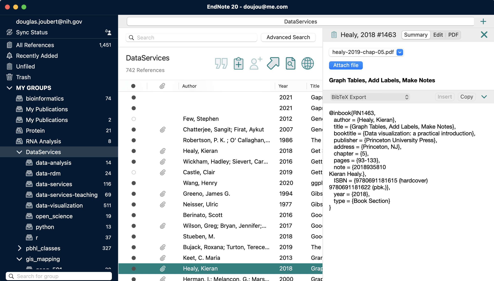{width="640"}

Figure 20: Example of a record in bibtext format.

The BibTeX [website](http://www.bibtex.org/Format/) is a great resources for learning more about formatting options. Overleaf is another great [resource](Bibliography%20management%20with%20bibtex) with a focus on bibliographic management.

## Saving Your Reference List

There are two ways to export the selected references from Endnote:

1.  Copy and past into a text document
2.  Using the Export feature in Endnote

I will cover using the Export feature from Endnote. These steps are very similar in Zotero, Refworks or Mendeley [Figure 21]:

1.  Make sure you have selected your records
2.  Choose File-\>Export in Endnote
3.  Make sure the Output Style says BibTeX
4.  Make sure the file extension is bib
5.  Make sure you are saving the file in the same folder as your RMD file.
6.  Click Save
7.  Make sure the file was saved to the correct directory. Note, that you might have to manually check the file extensions after you export it.

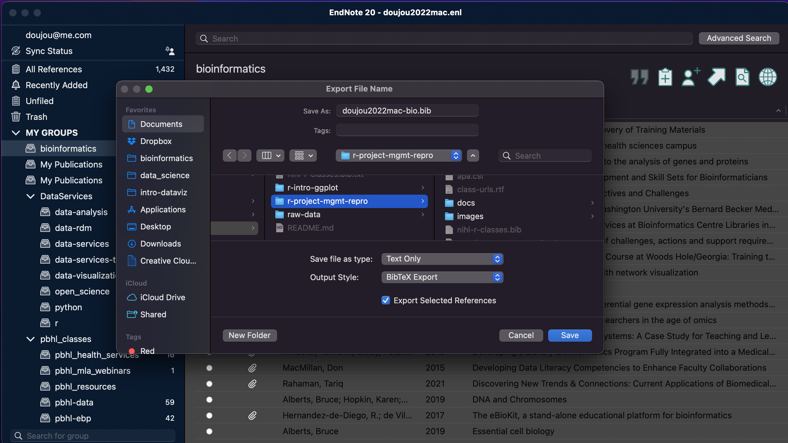{width="640"}

Figure 21: Using the Export feature in Endnote.

## Linking the Bib File to Your RMD file

You must link the bib file and any associated output styles in the Header of your RMD file. You need to add the following lines of code in the Header [Figure 22].

`bibliography: nihl-r-classes.bib`

`csl: apa.csl`

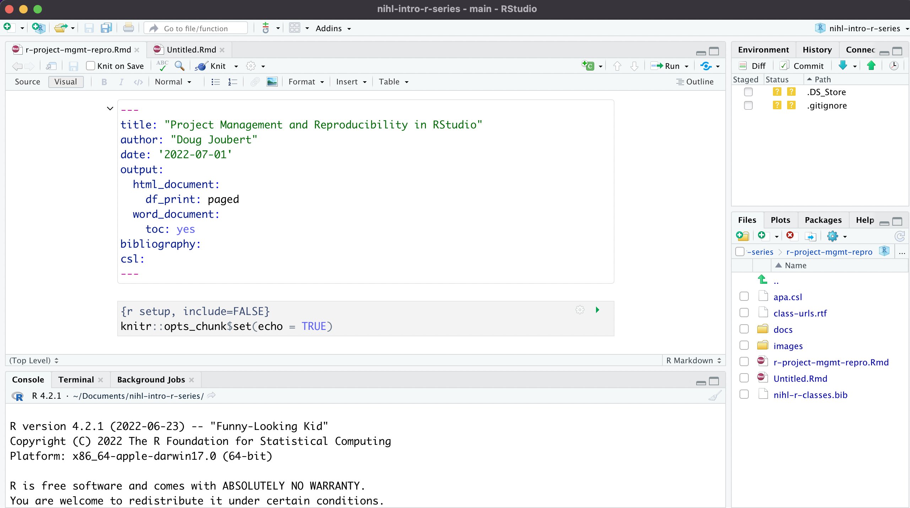{width="642"}

Figure 22: Modifying the RMD header.

Choose Insert\>Citation within RStudio. When you do this, you should see the records in the linked bib file [Figure 23].

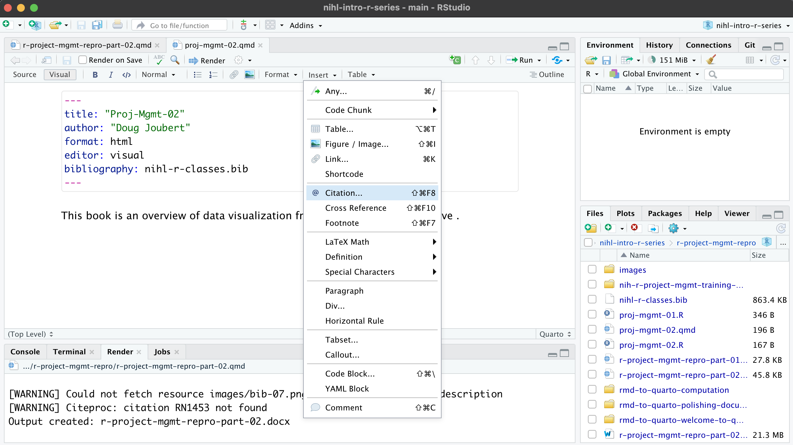{width="640"}

Figure 23: Inserting a citation in RStudio in Visual Mode.

The search box in Figure 23 is a free text search. This means that it will search on the Author names and the title. Thus, if I search for the name **Cimino**, the reference list will filter to contain records that match my search string [Figure 24.

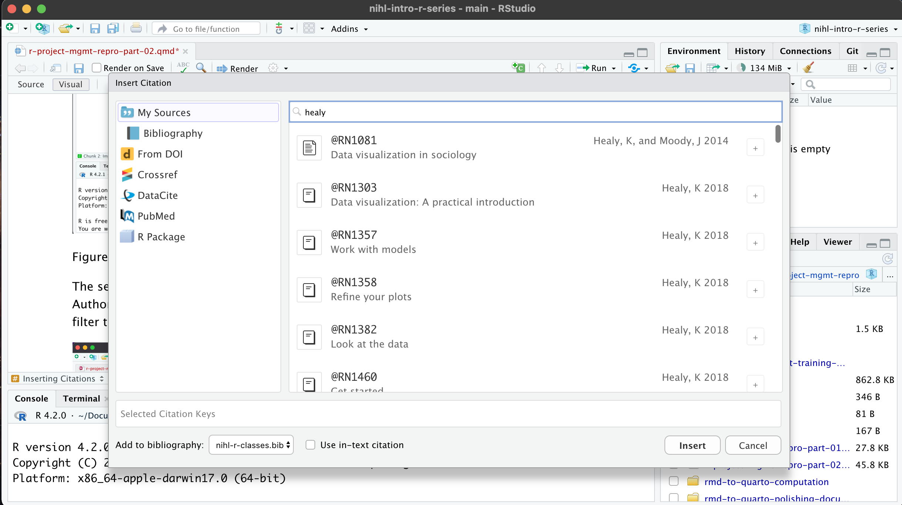{width="640"}

Figure 24: Searching for a record in your bib file.

The record number should appear at the insertion point in your RMD file [Figure 25].

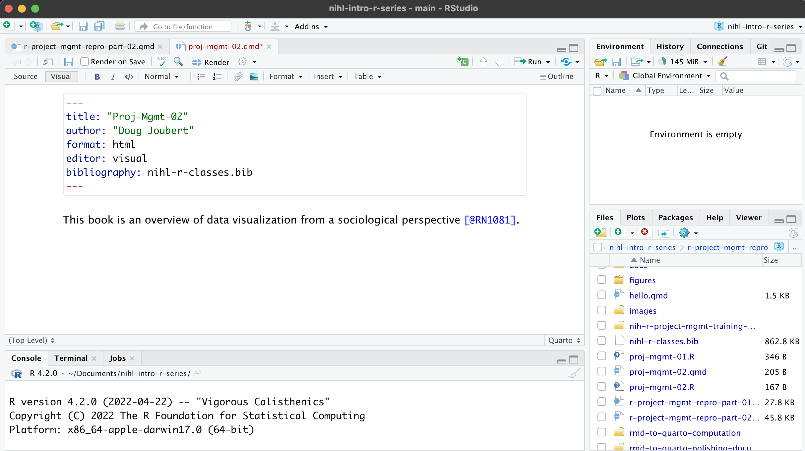{width="640"}

Figure 25: Reference inserted into a RMD document.

## **Changing Citation Styles**

By default, RStudio via Pandoc will use a Chicago author-date format for citations and references. To use another style, you will need to specify a CSL (Citation Style Language) file in the csl metadata field in the YAML.

But how can you identify which CSL you should use? You can find required formats on the [Zotero Style Repository](https://www.zotero.org/styles), which makes it easy to search for and download your desired style.

Download the format you wish to use and call it out in the YAML. We have pre-saved the APA CSL file in the project folder for you. But if you would like to follow the process or try another style, go to the Zotero Style repo and select [American Psychological Association 7th edition](https://www.zotero.org/styles/apa) or any other style of your choice. You will notice that it will automatically download the file (e.g. `apa.csl`). Make sure to save it to your project directory in report/source folder. In the YAML we have to call the exact name of the file preceded by \"csl:\"

# Publishing your project

# Licenses

**Licensed under [CC-BY 4.0](https://creativecommons.org/licenses/by/4.0/) 2022 by [the authors](https://carpentries-incubator.github.io/Reproducible-Publications-with-RStudio/CITATION).**
